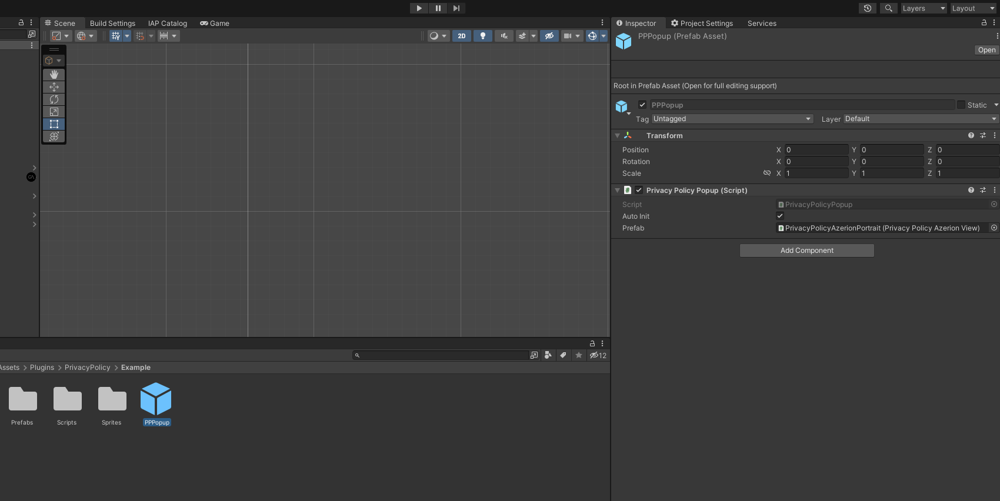

# Privacy Policy for Unity project
This asset is designed to be multi-lingual and show PrivacyPolicy automatically until the user accepts, and you can castigate the window to your liking. This example was developed for Azerion. There is text in 15 languages, automatically filled in according to the language of the user's device.

# Getting Started

1. Download and import the .unitypackage into your game.

    

2. Drag the prefab `PPPopup` into your scene. Prefab located in **`Assets/Plugins/PrivacyPolicy/Example/PPPopup.prefab`**.

    

## **Advice**

* If you need to wait for the user to finish the window, you can subscribe to the **`OnPopupEndEvent`** event. This event is triggered when the window is finished or when the application is restarted if the user has already accepted the agreement.

* You can call the PrivacyPolicy window an unlimited number of times, for example from the application settings, simply by calling the **`Show()`** method in the `PrivacyPolicyPopup` script.

* You can switch to a manual window display mode. To do this, you have to uncheck the `Auto Init` checkbox in the `PPPPopup` prefab. After that, the window will not appear automatically. To manually call the window, you need to call the method `Init()` in the script `PrivacyPolicyPopup`.
